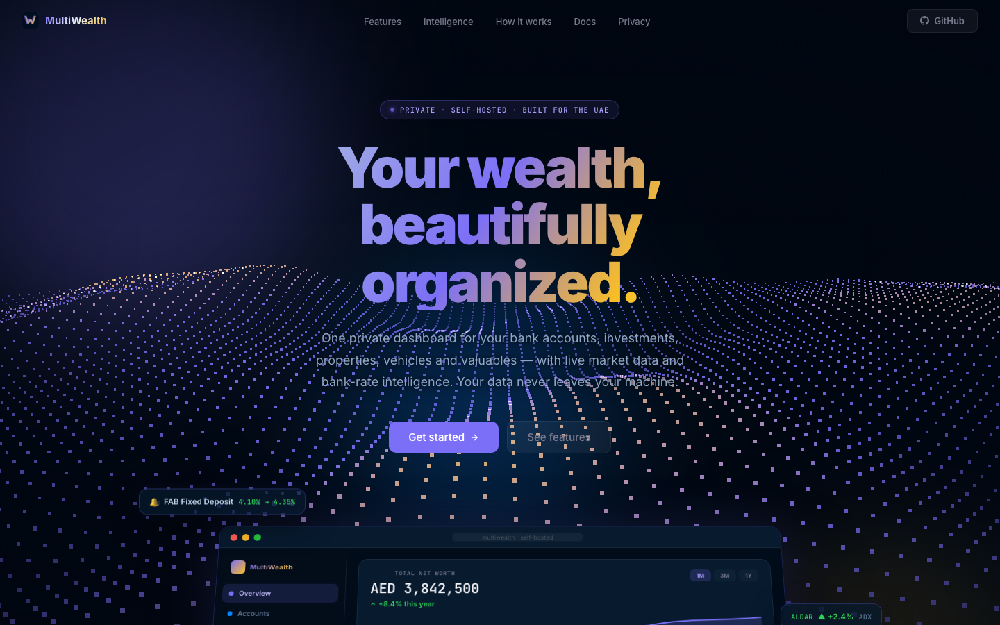
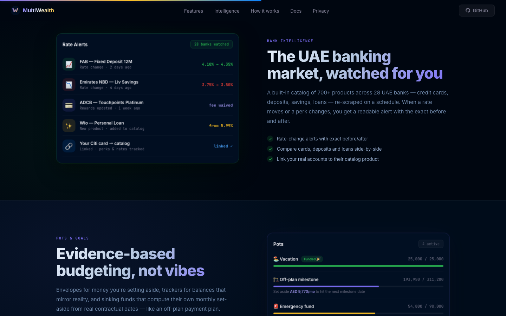
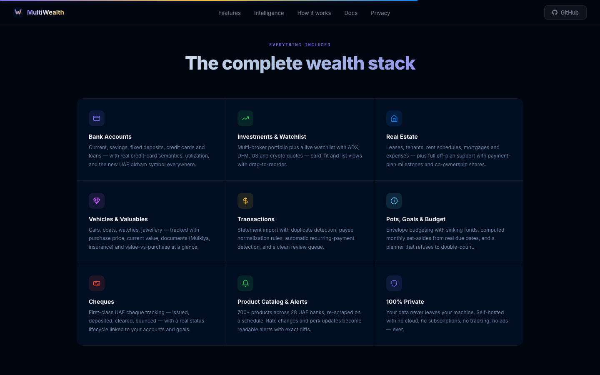

# MultiWealth

**A private, self-hosted wealth dashboard built for UAE finances.**

🌐 **Live site: [halkhoori2000.github.io/multiwealth-site](https://halkhoori2000.github.io/multiwealth-site/)**

One dashboard for everything you own — bank accounts, investments, properties,
vehicles and valuables — with live market data and bank-rate intelligence on top.
Your data never leaves your machine.

## What it does

- **Net worth** — every account, holding, property and tangible asset in one live
  view, including off-plan payment plans and co-ownership shares
- **Transactions** — PDF/CSV statement import with duplicate detection, payee
  normalization and automatic recurring-payment detection
- **Investments** — multi-broker portfolio plus a live watchlist with ADX, DFM,
  US-market and crypto quotes
- **Bank intelligence** — a catalog of 700+ products across 28 UAE banks,
  re-scraped on a schedule; rate changes become readable alerts with exact
  before/after diffs
- **Pots & goals** — envelope budgeting with sinking funds that compute their own
  monthly set-aside from real contractual dates
- **Real estate** — leases, tenants, rent schedules, mortgages, milestones
- **Cheques** — first-class UAE cheque lifecycle tracking

## Privacy first

MultiWealth runs entirely on your own computer or server. No cloud, no accounts,
no analytics, no subscriptions, no ads.

## Status

The application is under active development in a private repository. This repo
hosts the public landing site. Interested? Open an issue here to get in touch.

## Deploying

The site serves from the `gh-pages` branch (GitHub Pages, legacy build).
To deploy: `git push origin main:gh-pages`.
